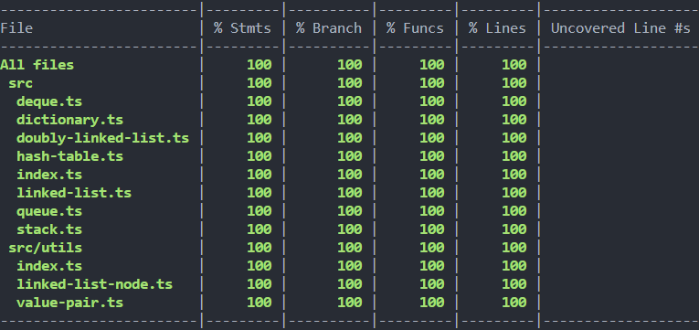

# Javascript 数据结构与常用算法

读完《学习 JavaScript 数据结构与算法(第三版)》，受到很多启发。特将一些数据结构与算法记录下来，也算巩固了一次。本库中全部内容都可以在原文中找到，如需学习建议直接阅读原文。

> 本库支持导出 UMD 和 ES 两种格式引入

## 安装

### 浏览器引入：

```html
<script src="https://cdn.jsdelivr.net/npm/@huangyunhui/js-datastructure@x.x.x">
  // 注意@x.x.x替换成真实版本号
</script>
<script>
  const stack = new jsDatastructure.Stack(); // 创建一个栈数据结构的常量
</script>
```

### 使用 npm：

```shell
$ npm i @huangyunhui/js-datastructure --save
```

方法使用示例：

```typescript
import {Stack} from '@huangyunhui/js-datastructure';

const stack = new Stack<number>(); // 创建一个只接收数字类型元素的栈数据结构常量
```

## 测试



## 目录

### 数据结构

- [栈](./src/stack.ts)
- [队列](./src/queue.ts)
- [双端队列](./src/deque.ts)
- [链表](./src/linked-list.ts)
- [双向链表](./src/doubly-linked-list.ts)
- [字典](./src/dictionary.ts)
- [HashTable](./src/hash-table.ts)
- ...

### 算法

- ...

## 维护者

[@黄云辉](https://github.com/1562066102)

## 使用许可

[MIT](LICENSE) Copyright (c) 2022-present, Huangyunhui
